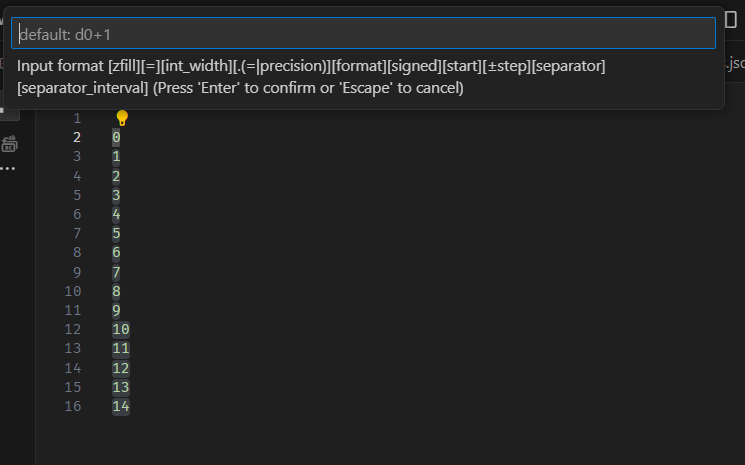
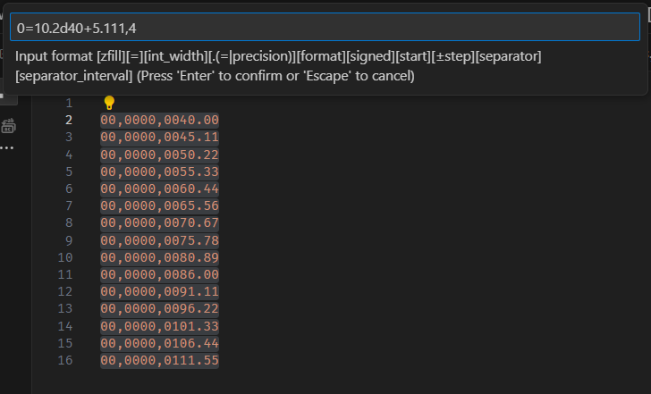
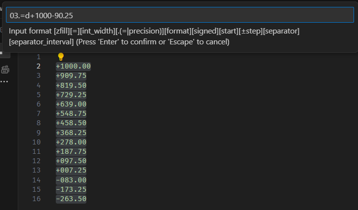
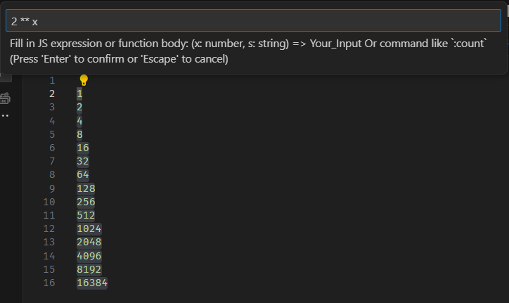

# README
Extension for inserting sequential numbers and manipulating text under multiple cursors.  
* insert sequential numbers with rich formatting  
* run custom functions on selected text  

This is inspired by [Insert Numbers](https://marketplace.visualstudio.com/items?itemName=Asuka.insertnumbers)  
and [Insert Numbers (Fix)](https://marketplace.visualstudio.com/items?itemName=alpsmonaco.insertnumbersfix)  

## Usage

### Insert
Running the command `manipulatenumbers.insertNumbers` (`Ctrl+Alt+N`) opens prompt to insert format:  
`[zfill][=][int_width][.(=|precision)][format][+][start][±step][separator][separator_interval]`  
* `zfill` - Either 0 or space (space is default). This character will be appended to the left of number (if needed by the `width`).  
* `=` - If present, all inserted numbers will be of equal width (smaller numbers will be padded with `zfill`).  
* `int_width` - Number of integer digits. If number is smaller than this, it will be padded with `zfill`. This can be used along with `=` above.  
* `precision` - Either integer or =. If integer, all numbers will be rounded to this amount of decimals. If =, all numbers will have the same amount of decimals (least possible without rounding).  
* `format` - d or D for decimal, x or X for hex, (and in future c or C for characters). x will produce lowercase c0ffee, and X will produce uppercase C0FFEE. You **need** this if you have anything before this.  
* `+` - If present, positive numbers will have + in front (negative numbers always have -).  
* `start` - integer or rational number.  
* `±step` - integer or rational number (use + for ascending, and - for descending sequences).  
* `separator` - Thousands separator. Either comma, space, or underscore. (TODO: add apostrophe).  
* `separator_interval` - `separator` appears every …! For decimal, default is 3, for hex 2.  

Important note: if you have anything before `format`, you also need `format`.  

Immediatelly after inserting, you will be offered to run manipulation, which you can cancel by pressing Escape or Enter.

### Manipulate
Running the command `manipulatenumbers.manipulateNumbers` (`Ctrl+Alt+M`) opens prompt to insert expression.  
Run any JS expression or function (or special command!) on selected text.  

Expressions are written as if they appear right of the following arrow function:  
`(x: number, s: string) => `  
Meaning you can either have simple expressions like `x + 1` or complex functions `{ return x + 1; }`.  
`s` is text in string format, and `x` is result of `Number(s)` (which is `NaN` if `s` is not a number).  

Special commands are in format `:count`.  
Currently, only `:count` is supported.  

## Examples

  
  
  
(For manipulation, first was inserted numbers 0 to 14 (see 1st image), and then `2 ** x`)  
  

## Source

my:  
* GitHub https://github.com/BartolHrg/vscode-ManipulateNumbers
* Visual Studio Marketplace https://marketplace.visualstudio.com/items?itemName=BartolHrg.manipulatenumbers

original:  
* GitHub https://github.com/Inori/vscode-InsertNumbers
* Visual Studio Marketplace https://marketplace.visualstudio.com/items?itemName=Asuka.insertnumbers

2nd version:  
* GitHub https://github.com/AlpsMonaco/vscode-InsertNumbers
* Visual Studio Marketplace https://marketplace.visualstudio.com/items?itemName=alpsmonaco.insertnumbersfix

(honestly, I don't know what sections below are)

## Patch/Fix Notes
* select first number group while calling this extension,avoid extra number group.
* correct to the latest standard of `TypeScript`.
* update to latest vscode API.
* update sprintf.js,remove `TSSprintf.ts`.

## Changes
* Version 0.9.0: April 29, 2016

    First version

*Enjoy!*
