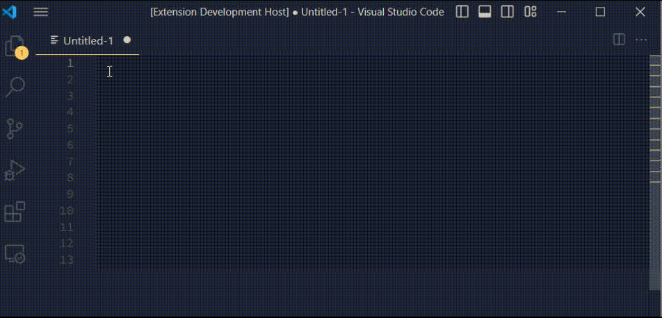

# README
This is a patch/fix version for extension [Insert Numbers](https://marketplace.visualstudio.com/items?itemName=Asuka.insertnumbers).  
When using the original [Insert Numbers](https://marketplace.visualstudio.com/items?itemName=Asuka.insertnumbers) extension,you might have encountered a bug that an extra number group inserts before the number group you input.  
This is what this extension fix for.  

## Usage
You may still have the original [Insert Numbers](https://marketplace.visualstudio.com/items?itemName=Asuka.insertnumbers) extension,so I add a new command `Insert Numbers (Fix)` to avoid confusion.  
I also keep the `Insert Numbers` command,so you can use it directly after you unistall the original [Insert Numbers](https://marketplace.visualstudio.com/items?itemName=Asuka.insertnumbers) extension.

## Background
This extension certainly helped me a lot for years,speeded up and simplified tedious tasks.  
Due to the update of `VSCode`,the original extension works defective now.  
Since we are unable to contact author of the original extension,    
I fork it and managed to fix it,recover to the original behavior.

## Source
### Origin
* GitHub https://github.com/Inori/vscode-InsertNumbers
* Visual Studio Marketplace https://marketplace.visualstudio.com/items?itemName=Asuka.insertnumbers

### Patch/Fix Version
* This Repository https://github.com/AlpsMonaco/vscode-InsertNumbers

## Patch/Fix Notes
* select first number group while calling this extension,avoid extra number group.
* correct to the latest standard of `TypeScript`.
* update to latest vscode API.
* update sprintf.js,remove `TSSprintf.ts`.

## Insert Numbers for Visual Studio Code
An extension to insert increasing numbers.

## Usage
* Command: `Insert Numbers`
* Keybindings: `ctrl+alt+n` on Windows and Linux or `cmd+alt+n` on OSX

## Control format
The format of the inserted numbers is controlled by a C-Style format string using in a sprintf function.

There are two ways to change the default format string.
* You can change your `settings.json` file to modify the default value:

    
    
* You can input format string in the `InputBox` each time you toggle insert. The format string can be a single string like `%02d`:

    

    or with start number and step, like `%08X:0:4`:

    

    ### Note
    * Do not input more than one type specifier in a format string. If you want to input more than one number, you can do it another time.
    * Do not input `':'` in format string.

## Thanks
* [sprintf.js](https://github.com/alexei/sprintf.js)

## For more information or bug reports
* [GitHub](https://github.com/Inori/vscode-InsertNumbers/)

## Changes
* Version 0.9.0: April 29, 2016

    First version

*Enjoy!*
